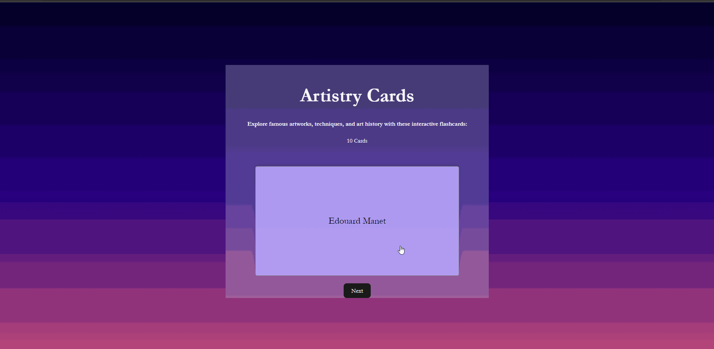

# Project 2: Flashcards! Part 1

Submitted by: Ariyan Fatemi

This web app: App.jsx

Time spent: 2.5 hours spent in total

## Required Features

The following **required** functionality is completed:

- [x] **Utilized useState() to create state variables to help control component behavior**
- [x] **Used the onClick() event to call a method**
- [x] **Created multiple div sections to keep track of different chunks of information**
- [x] **Used those div sections as the basis for CSS styling**
- [x] **Clicking on the card shows the corresponding component of the information pair
Clicking the next button displays a random new card**

## Video Walkthrough

Here's a walkthrough of implemented required features:

## Notes

N/A

## License

    Copyright [2023] [Ariyan Fatemi]

    Licensed under the Apache License, Version 2.0 (the "License");
    you may not use this file except in compliance with the License.
    You may obtain a copy of the License at

        http://www.apache.org/licenses/LICENSE-2.0

    Unless required by applicable law or agreed to in writing, software
    distributed under the License is distributed on an "AS IS" BASIS,
    WITHOUT WARRANTIES OR CONDITIONS OF ANY KIND, either express or implied.
    See the License for the specific language governing permissions and
    limitations under the License.
